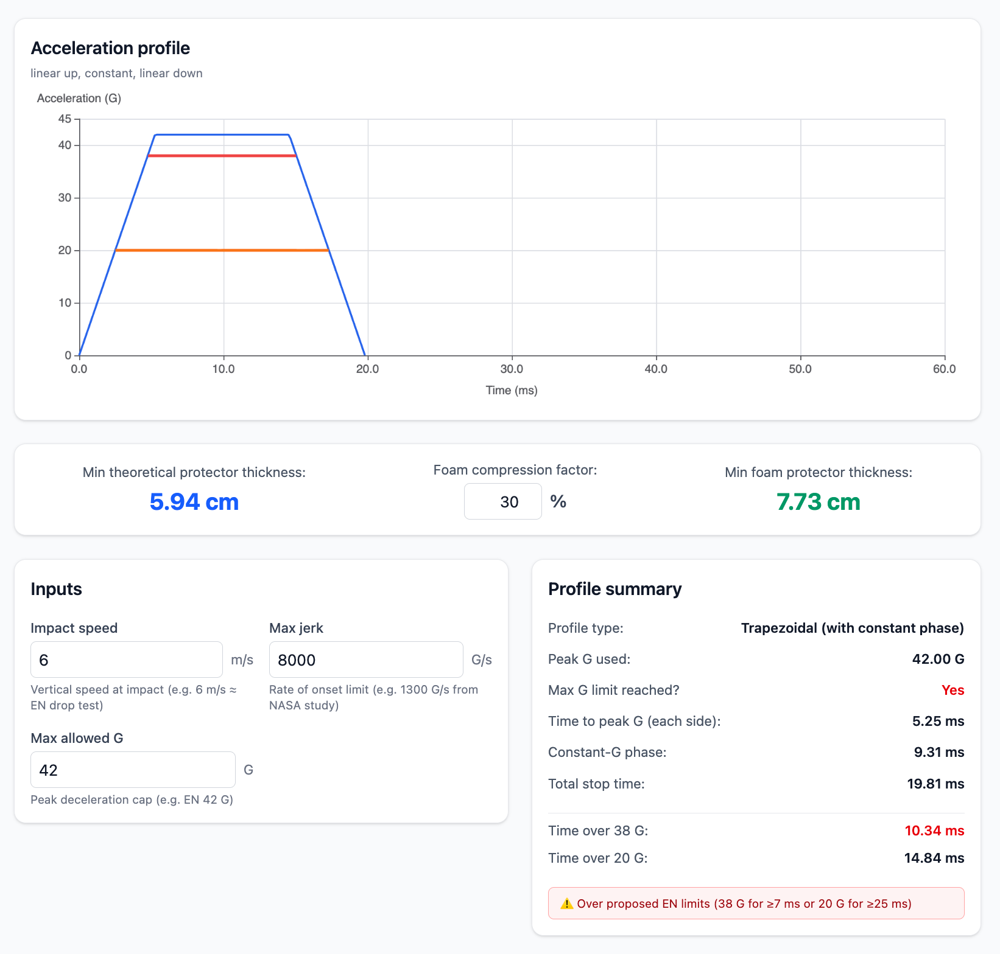

# harnessvis

## Overview

Visualize jerk and G limited paragliding harness back protectors.

## Live Website

**[harnessvis.hyperknot.com](https://harnessvis.hyperknot.com)**



## Local Development

1. Install dependencies:

   ```bash
   pnpm i
   ```

2. Navigate to the frontend directory:

   ```bash
   cd fe
   ```

3. Start the development server:

   ```bash
   pnpm dev
   ```

4. Open the URL shown in your terminal to start developing.

## Deployment

Deployments are manual. From the repository root, run:

```bash
./deploy.sh
```

The script builds `fe` and deploys the `harnessvis-website` Worker with Wrangler.
Run `pnpm --dir fe exec wrangler login` first if Wrangler is not authenticated.

To prevent pushes from deploying through Cloudflare Workers Builds, disconnect
the Git repository in **Workers & Pages → harnessvis-website → Settings → Builds
→ Disconnect**. This Cloudflare setting is not stored in this repository.

## License

MIT License
